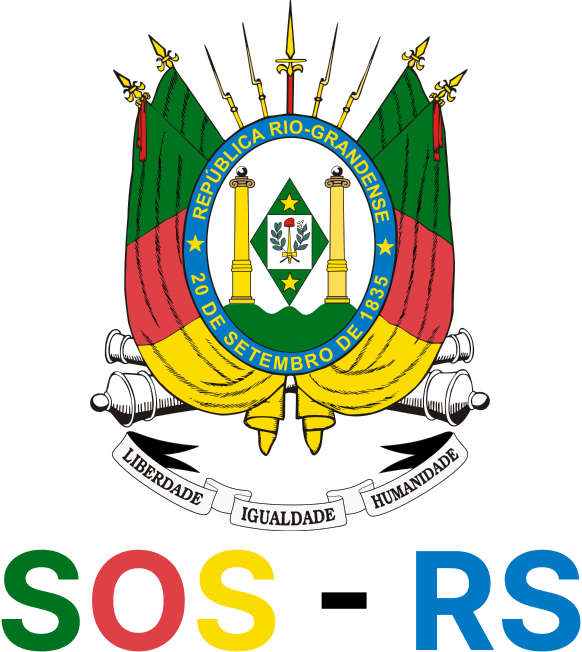

## Description

Backend for SOS system - RS

Features:
- Add SOS points
- Search for SOS Points
- Delete SOS Points

## Installation

```bash
$ npm install
```

## Running the app

```bash
# development
$ npm run start

# watch mode
$ npm run start:dev

# production mode
$ npm run start:prod
```

## Test

```bash
# unit tests
$ npm run test

# e2e tests
$ npm run test:e2e

# test coverage
$ npm run test:cov
```

## Support

SOS is an MIT-licensed open source project. It can grow thanks to the sponsors and support by the amazing backers. If you'd like to join them, please [read more here](https://docs.nestjs.com/support).

## Stay in touch

- Author - [Lucas Fausto Medeiros](https://github.com/lucasfstmd)

## License

SOS - RS is [MIT licensed](LICENSE).
